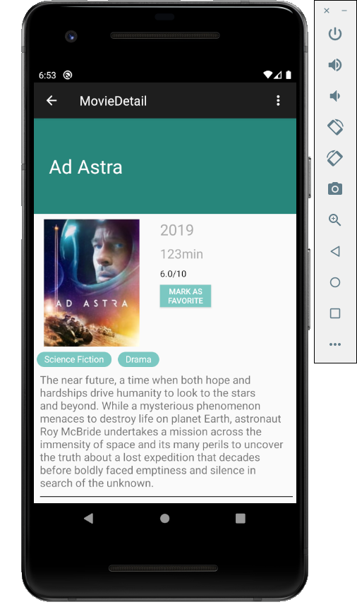
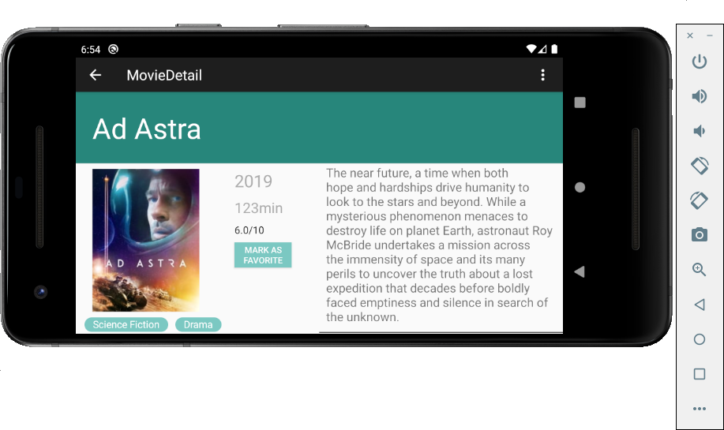

# PopularMovies
My project for Android nanodegrees.
Most of us can relate to kicking back on the couch and enjoying a movie with friends and family.
In this project, you’ll build an app to allow users to discover the most popular movies playing.

## Preview

- Home page

  

- Details page

  
  
  

## Getting Started

  - Create ***apikey.properties*** file in root of this project
  - Add your key for TMDB API in this file with key ***tmdb_api_key*** (ex: tmdb_api_key=XXXXXXXXXXX)
